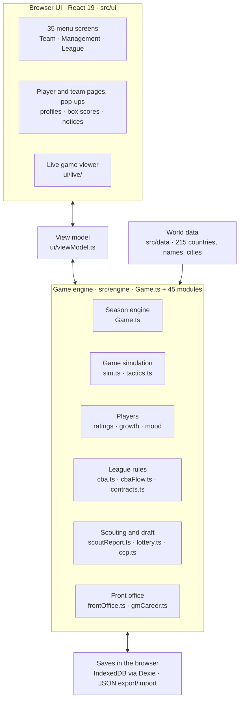
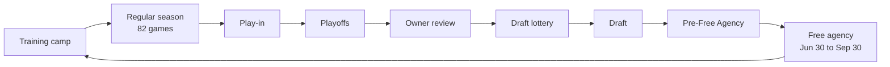

# Feature map

What Basketball Manager has today, how the pieces fit together, and where each one lives in the code. Check here before building on or changing a feature, and keep it current when features are added, moved or removed.

- `docs/SPEC_STATUS.md`: the spec, point by point, with status.
- `docs/HANDOFF.md`: the product spec and the rules the engine follows.
- `CHANGELOG.md`: what changed and when (shown in the game as "What's new").

_Last reviewed: 2026-10-02 (player development phase 1; God Mode owner powers, owner backgrounds, draft surprises, past drafts, rookie cards)._

## How it fits together

There's no server. The whole game runs in the browser, saves to IndexedDB and is hosted as a static site on GitHub Pages. Almost all of the logic sits in one engine object (`src/engine/Game.ts`). Screens read their values from the view model (`src/ui/viewModel.ts`) and call engine methods for actions; the engine notifies React through `subscribe` / `useSyncExternalStore` (`src/App.tsx`).

| Layer | Where | Notes |
|---|---|---|
| Entry and autosave | `src/main.tsx`, `src/App.tsx` | Title screen or open league; autosaves 700 ms after a change and when the tab is hidden |
| Shells and routing | `src/ui/GMView.tsx`, `src/ui/shell/` | Three layouts: Almanac (sidebar), Broadsheet (masthead), Desk (icon rail) |
| View model | `src/ui/viewModel.ts`, `src/ui/vm.ts` | Menu (`NAV`), phase bar actions, every screen's values |
| Engine store | `src/engine/Game.ts` | `db` (players `db.P`, schedule, caps) is mutated in place; `state` is replaced through `setState` |
| Saves | `src/db/saves.ts` | One IndexedDB row per league (`Game.toSave()`); export/import as JSON |
| Hosting | `.github/workflows/deploy.yml`, `scripts/deploy-pages.sh` | Every push to the development branch builds and pushes `dist/` to the `gh-pages` branch (GitHub Actions); `npm run deploy` does the same by hand |

## The season loop

Each step is a button on the phase bar (`phase` in `state`). After free agency the loop goes back to training camp.

| Step | `phase` | What happens | Code |
|---|---|---|---|
| Training camp | `preseason` | Summer development (ratings move, ceilings re-estimated, hidden gems surface), retirements, a new class of about 100 prospects, expansion. You cut to 15 standard + 3 two-way contracts. Opening night: short rosters filled with minimum deals, media predictions locked, AI extensions, fire sale if the owner's payroll order is unmet. | `Game.startPreseason()`, `Game.startSeason()`, `progress.ts`, `media.ts` |
| Regular season | `regular` | 82 games, late October to mid-April. Sim a day/week/month/to the deadline/to the end, or watch live. AI teams trade, sign and waive (35% chance a day). Injuries, fatigue, monthly development and scouting reports, mentoring. All-Star Weekend mid-February, trade deadline early February. | `Game.sim()`, `Game.simDay()`, `sim.ts`, `allStar.ts`, `cbaFlow.seasonTick()` |
| Play-in | `playin` | Awards announced. Each conference: 7 v 8, 9 v 10, then the game for the 8 seed. | `Game.startPlayin()`, `Game.simPlayin()`, `awards.ts` |
| Playoffs | `playoffs` | Best-of-7 East and West, then the Finals. When it ends: the owner's year-end letter and the Hall of Fame vote. | `Game.startPlayoffs()`, `Game.simPo()`, `ownerLetter.ts`, `hof.ts` |
| Owner review | `playoffs` → `lottery` | Incentives paid, owner verdicts (you can be fired), your GM contract, the job market. | `frontOffice.seasonReview()`, `gmCareer.ts` |
| Draft lottery | `lottery` | 3-2-1 lottery (16 teams, all 16 picks drawn), 2nd-apron penalty, pick protections and swaps settle. | `Game.runLottery()`, `lottery.ts`, `pickRules.ts` |
| Draft | `draft` | Two rounds, 60 picks, rookie-scale deals, draft promises and draft-night heists. | `Game.aiDraft()`, `Game.draftPick()`, `cbaFlow.signDraftee()` |
| Pre-Free Agency | `draft` (with `preFA`) | Player options decided; you decide team options, expiring contracts (re-sign, keep Bird rights, qualifying offer, renounce) and extensions. | `preFA.ts`, `PreFAScreen.tsx` |
| Free agency | `fa` | New league year (cap grows, exceptions reset, team sales close), moratorium until July 6, offer sheets, owner payroll orders. 92 days. | `Game.startFA()`, `Game.advanceFA()`, `cbaFlow.ts`, `contracts.ts` |

## Feature areas

### Game simulation
- One possession-by-possession engine plays every game, watched or simmed.
- Tuned to 2026 NBA averages (pace 98.8, 113.8 points); league norms re-center ratings every season.
- Four shot tiers (rim, mid-range, corner 3, above-the-break 3; five zones in the UI), usage-based shot selection, Four Factors clutch tiebreaker.
- Tactics: pace, offense and defense schemes, lead and trail presets, schemes unlocked by player roles.
- Fatigue, minor and major injuries, home and road splits, personality effects (selfish, clutch, crowd-fed).
- Live game: scoreboard, box score, play-by-play, five speeds, step or sim to the end.
- Box score for every game; per game, totals, per 36, shooting and advanced stats; league leaders.

Screens: Live game, Box score, Stats, League stats, Tactics. Code: `sim.ts`, `tactics.ts`, `norms.ts`, `advanced.ts`, `leaders.ts`, `ui/live/`.

### Season and league
- 30 teams (15 per conference), 82 games, standings by conference or division.
- All-Star Weekend in mid-February, trade deadline in early February.
- Play-in, East and West best-of-7 brackets and the Finals, with "if the season ended today" views.
- Awards voted by editable formulas: MVP, DPOY, ROY, 6MOY, MIP, Finals MVP, All-League, All-Defense, All-Rookie and more.
- Media preseason predictions and a press room.
- Hall of Fame (3-season wait, up to five a year), league history, league-wide transactions.
- Expansion from 45 ready-made franchises or your own design, with an expansion draft.

Screens: Dashboard, Standings, Schedule, Playoffs, Awards, Predictions, Hall of Fame, Press room, Transactions. Code: `Game.ts`, `awards.ts`, `formula.ts`, `allStar.ts`, `media.ts`, `hof.ts`, `txlog.ts`.

### Roster and coaching
- Rotation by drag and drop, starters, per-player minute targets, keep sorted, play through injuries.
- Depth chart and the assistant coaches' lineup advice with one-click apply.
- 20 ratings (including acceleration, layups, box-out, blocks, steals), measured wingspan, badges.
- Potential (`potential.ts`) is a ceiling, not a destination. Each player has hidden ceilings per skill and a development plan from his first season to about 27. His hidden pace decides how much of the plan he gets, and a lost year is never made up. True potential (`p.tpot`) is what he could still reach if everything goes right. The potential shown (`p.pot`) is the league's scouting read of it: off by a few points for prospects, sharpening each season. AI teams use that read; your staff reads your own players closely. God Mode shows the truth: the profile ring ("True potential"), tables, the draft board, and on the Development tab the skill ceilings, full ceiling and pace. The editor's slider sets it.
- Player development (`development.ts`): how much a player grows is set in `Game.ts` (age, room under potential, hidden development factor, work ethic, form, minutes, coaching); where it lands is his own hidden development profile. Specialists pour growth into one area, others grow two or round out, and the direction carries from year to year. Skills he isn't working on stall or slip. His body has its own track: athletic peak 26–29, frame limits on strength and stamina, and young players arrive with their athleticism mostly there. Coaching is a capped multiplier (at most +12%), and training focus decides where growth goes. Your players' Development tab shows "How he develops".
- Training focus per player, hidden decimal growth, monthly development reports, year-over-year progress.
- Locker room morale; veteran mentors who pass on or remove traits.
- Player moods with every factor explained on hover; jersey numbers.

Screens: Roster, Depth chart, Development, Tactics. Code: `assistants.ts`, `coaches.ts`, `lockerRoom.ts`, `ratings.ts`, `development.ts`, `progress.ts`, `jerseys.ts`.

### Contracts and trades
- Salary cap, luxury tax with repeater rates, 1st and 2nd aprons, salary floor.
- Max and minimum by service, rookie scale, full / early / non-Bird rights, cap holds.
- Exceptions: MLEs, room, bi-annual, minimum, disabled player; hard caps.
- Two-ways, Exhibit 10s, 10-days, hardship; waive, stretch, buyouts, waiver claims.
- Trades: salary matching by apron, trade exceptions, kickers, no-trade clauses, pick protections and swaps, assistant GM advice, shopping a player for offers.
- Pre-Free Agency: options, qualifying offers, re-sign or renounce, extensions.
- Free agency on the NBA calendar: moratorium, restricted free agency and offer sheets.
- Cap outlook: real cap history since 1984-85 and a 500-season projection.

Screens: Trade, Pre-Free Agency, Free agency, Cap sheet, Contracts, Cap outlook. Code: `cba.ts`, `cbaFlow.ts`, `contracts.ts`, `capModel.ts`, `pickRules.ts`, `tradeAdvice.ts`, `tradeOffers.ts`, `preFA.ts`.

### Scouting and draft
- Scouts with regional specialties; talent regions in tiers 1 to 4; the scouting budget sets accuracy.
- Scouting reports with margins: 12 graded categories, strengths, weaknesses, player comparisons.
- Scout briefs: tell a scout what to look for and he finds players himself.
- Shortlist, draft board and mock drafts; about 100 prospects a year, 60 drafted.
- 3-2-1 lottery with exact odds and a lottery-night reveal.
- Draft promises and draft-night heists.
- Draft surprises: each prospect has a hidden "NBA translation" that shows at his first training camp. His level moves (about half ±2, the rest 3–6 either way, about one in eight a real bust or steal), his shape shifts (e.g. shooting up, playmaking down), and his ceiling moves too. You get a camp report; God Mode profiles can peek.
- Past drafts: every pick of every draft held in the league, with draft-night rating, first camp, rating now, career line and where he is.
- Overseas market: buyouts, league-strength translation, redemption arcs, 15-game adjustment.
- CCP development league and G League affiliates with call-ups.

Screens: Scouting, Shortlist, Draft (with Past drafts), Lottery, Overseas, CCP. Code: `scoutReport.ts`, `scoutBrief.ts`, `lottery.ts`, `translation.ts`, `overseas.ts`, `ccp.ts`, `gleague.ts`, `txlog.ts` (`pickUsed`).

### Owner and career
- Finances: revenue, ticket price, coaching / health / facilities / scouting budgets on sliders with Auto.
- Five owner archetypes with made-up named owners, biographies and a directory; team sales.
- About forty owner backgrounds (how the money was made and how they got the team: bought, inherited, founding partner, local group), never two the same in a league, stored on the team (`ownerBg`).
- Owner reviews, year-end letters, payroll orders and opening-night fire sales; you can be fired.
- You as the GM: name, nationality, experience, headshot, your contract and extensions.
- Job market: vacancies, applications, offers, switching teams.
- Player incentives (likely and unlikely), stat-padding dilemmas, press quotes.

Screens: Finances, Owner, Career, Press room. Code: `frontOffice.ts`, `owners.ts`, `ownerLetter.ts`, `gmCareer.ts`.

### World and players
- 215 countries with population groups, name pools, cities, flags and scouting regions.
- Native-script names next to romanized ones (Cyrillic, Arabic, Thai, Vietnamese diacritics and more).
- Heritage, birthplaces and hometowns; national-team eligibility.
- Personality traits (Egotistic, Clutch, Selfish, Streaky and more), hidden intangibles and hidden gems.
- American first names weighted by frequency, with spelling variants (the Jalen family, Mikal/Mikel/Mikael) rarer than the names they come from.
- Ready-made player cards: Luka Dončić plus seven rookies (Knecht, Simmons, Horford, Paul, Thompson, Leonard, Howard), each tuned against his real rookie season translated to today's league.
- Families: sons and brothers of former players.
- Generated faces or uploaded headshots; retirements and an optional retirement age.

Screens: player profile (Overview, Contract, Development, History, Comparison), country lists. Code: `src/data/`, `eligibility.ts`, `family.ts`, `faces.ts`, `traits.ts`, `intangibles.ts`.

### Control and saves
- Run 1 to 30 teams: My teams dashboard, switch teams, take over or hand a team to the AI.
- God Mode: edit any player (ratings, bio, traits, injuries), team and league editor (names, colors, logos, arena, cap), force trades, daily schedule, player cards.
- God Mode owner powers: the owner has nothing over you (no firing, payroll orders, fire sales or meddling; your contract renews itself; players sign whatever you offer). Edit any owner (type, kind, background, worth, purchase, bio) or force a team sale; move any player to any team from his profile (`godMove.ts`).
- Easy mode: hand off lineups, tactics, contract paperwork, free agency, draft picks, firing, scouting, injuries.
- Tutorial (quick or in-depth) and What's new from the changelog.
- Three layouts, light and dark themes, team-color accents, player search.
- Autosave to IndexedDB, many leagues, JSON export and import; worst-roster start option.

Screens: My teams, Settings, League editor, Player cards, Daily schedule, Tutorial, What's new. Code: `easy.ts`, `playerCard.ts`, `GodPlayerEditor.tsx`, `Tour.tsx`, `db/saves.ts`.

## Menu screens

The menu is `NAV` in `src/ui/viewModel.ts`; `GMView.tsx` picks the component. Screens marked † appear only in God Mode (My teams also appears when you run more than one team).

| Group | Screen → file (`src/ui/screens/` unless noted) |
|---|---|
| Team | Dashboard → `DashboardScreen` + `InboxCard` · Schedule → `ScheduleScreen` · Roster → `RosterScreen` · Depth chart → `DepthChartScreen` · Development → `DevelopmentScreen` · Tactics → `TacticsScreen` · Finances → `FinancesScreen` · Cap sheet → `CapSheetScreen` · Contracts → `ContractsScreen` |
| Management | Trade → `TradeScreen` · Pre-Free Agency → `PreFAScreen` · Free agency → `FreeAgencyScreen` · CCP → `CcpScreen` · Draft → `DraftScreen` + `MockDrafts` · Shortlist → `ShortlistScreen` · Scouting → `ScoutingScreen` + `ScoutReportsSection` · Overseas → `OverseasScreen` · Owner → `OwnerScreen` · Career → `CareerScreen` · Player cards† → `CardsScreen` |
| League | My teams† → `MyTeamsScreen` · Standings → `StandingsScreen` · Transactions → `TransactionsScreen` · Playoffs → `PlayoffsScreen` · Awards → `AwardsScreen` + `AwardFormulas` · Predictions → `PredictionsScreen` · Hall of Fame → `HallOfFameScreen` · Stats → `StatsScreen` + `LeagueStatsScreen` · Cap outlook → `CapOutlookScreen` · Settings → `SettingsScreen` + `RetirementSetting` + `ExpansionPicker` · Tutorial → `ui/Tour.tsx` · What's new → `ChangelogScreen` · League editor† → `LeagueEditorScreen` · Daily schedule† → `DailyScheduleScreen` · Press room → `PressScreen` |
| Not in the menu | Live game → `LiveGameScreen` + `ui/live/` · Play-in → `PlayinScreen` · Lottery → `LotteryScreen` · Title screen → `ui/TitleScreen.tsx` · Pop-ups → `ui/modals/` (player profile, team, box score, contract, owner letter, GM setup, God Mode player editor, card library, notices, confirm) |

## Engine modules

All in `src/engine/`.

| Module | What it does |
|---|---|
| `Game.ts` | The league: world generation, the season engine, phase transitions, trades AI, injuries, development, draft; the observable store |
| `sim.ts` | Possession-by-possession game engine used for every game |
| `tactics.ts` | Every tactical setting and what it does in the engine |
| `norms.ts` | League normalization that keeps averages on the 2026 baselines |
| `ratings.ts` | Team rating and player badges |
| `ratingDist.ts` | Rating percentiles across the league |
| `advanced.ts` | Basketball-Reference-style advanced stats |
| `leaders.ts` | League leaders (bold numbers) |
| `awards.ts` | Season awards from formulas |
| `formula.ts` | Safe expression compiler for award formulas |
| `allStar.ts` | All-Star Weekend |
| `hof.ts` | Hall of Fame eligibility and voting |
| `media.ts` | Preseason predictions: standings, win totals, title and award picks |
| `development.ts` | Where development lands: each player's development profile, the body's own track, work ethic, the coaching multiplier |
| `potential.ts` | Potential as a ceiling: skill ceilings, the development plan and hidden pace, true potential vs the league's scouting read |
| `progress.ts` | Opening-night and end-of-season rating snapshots |
| `intangibles.ts` | Intangibles and hidden gems |
| `traits.ts` | Personality traits and their descriptions |
| `lockerRoom.ts` | Team morale and mentoring |
| `assistants.ts` | Assistant coaches' lineup advice |
| `coaches.ts` | Assistant coaches running a player's training |
| `easy.ts` | Easy mode switches |
| `cba.ts` | The CBA: cap, tax, aprons, contract types, salary matching |
| `cbaFlow.ts` | The CBA through the league year: signings, releases, options, RFA, AI free agency |
| `contracts.ts` | Signing, accepting, waivers, stretch, buyouts |
| `capModel.ts` | Real cap history and the 500-season projection |
| `pickRules.ts` | Pick protections and swaps |
| `lottery.ts` | The 3-2-1 draft lottery and its odds |
| `preFA.ts` | Pre-Free Agency decisions |
| `tradeAdvice.ts` | Assistant GM's read on a trade |
| `tradeOffers.ts` | Trade offers when you shop a player |
| `txlog.ts` | Per-player transaction history |
| `frontOffice.ts` | Finances, owner reviews and firing, job market, press, incentives, payroll orders, fire sales, team sales |
| `owners.ts` | Who the owners are: how they made their money and what they're worth |
| `ownerLetter.ts` | The owner's year-end letter |
| `gmCareer.ts` | You as GM: identity and contract |
| `scoutReport.ts` | Scouting reports for any player |
| `scoutBrief.ts` | Scout briefs that find players |
| `overseas.ts` | Overseas market, league translation, scouting intel |
| `ccp.ts` | The CCP development league |
| `gleague.ts` | G League affiliates |
| `eligibility.ts` | National-team eligibility |
| `family.ts` | Sons and brothers of former players |
| `faces.ts` | Deterministic SVG faces |
| `jerseys.ts` | Jersey numbers |
| `playerCard.ts` | Player cards (a player's whole build, applied in God Mode) |
| `prune.ts` | Trims retired players to keep saves small |
| `translation.ts` | Draft surprises: a prospect's hidden NBA translation, applied at his first camp |
| `godMove.ts` | God Mode: move any player to any team (keeps his deal, or a fair new one) |
| `rng.ts` | Seeded mulberry32 RNG for world generation |

## Known issues to address

Tick these off (or delete them) as they're fixed. Severity is a first guess.

- [ ] **No automated tests.** There's no test runner; a change to the engine is only checked by playing. A headless "sim N seasons and check invariants" test would catch most regressions (players on two rosters, NaN salaries, stuck phases).
- [ ] **Type checking catches little.** `tsconfig.json` has `strict: false` and `noImplicitAny: false`, and most engine code is `any`.
- [ ] **No error boundary, and opening a league isn't guarded.** Nothing in `src/` catches render errors, and `App.tsx` calls `Game.load()` without a try/catch, so one bad save or render error blanks the whole app.
- [ ] **Large main bundle.** The main JS chunk is about 1.55 MB (520 KB gzipped), over the 800 KB warning. Two lazy screens don't split because they're also imported directly: `Tour.tsx` by `SettingsScreen.tsx` and `LeagueStatsScreen.tsx` by `StatsScreen.tsx`.
- [x] **The GitHub Actions deploy never runs.** Fixed: the workflow now runs on every push to the development branch and publishes to `gh-pages` with the same script as `npm run deploy`.
- [x] **`npm run deploy` can leave a stray worktree.** Fixed: an unchanged site publishes nothing, and the scratch worktree is always removed.
- [ ] **Dead check in `Game.sim()`.** It refuses to sim while an inbox item has `block`, but nothing ever sets `block` (`Game.ts`, `sim()`).
- [ ] **Very dense code.** Lines run to 3,471 characters (`viewModel.ts`); `Game.ts` is 165 KB. Splitting `Game.ts` by phase and formatting long lines would make reviews and diffs far easier.
- [ ] **Saves grow about 1.4 MB a season.** A headless run went 3.5 MB → 5.0 MB → 6.3 MB over three seasons, and later seasons sim slower (about 5 s → 7–12 s each, headless). Worth trimming old box scores, logs and per-game history before leagues reach 20+ seasons.
- [ ] **Player development, phase 3** (audit of 2026-10-02). Phase 1 is done (`development.ts`): development is player-specific, the body has its own track, every player has a work ethic, and coaching is a capped multiplier. Phase 2 is done (`potential.ts`): potential is a ceiling with per-skill ceilings, a hidden pace, and true vs scouted potential. Still to do:
  - [x] *Potential is a destination, not a ceiling.* Fixed in phase 2: a development plan and a hidden pace replace the catch-up term, and players peak on average about 3–4 below their true potential.
  - [x] *Potential is one number.* Fixed in phase 2: every skill has its own ceiling.
  - [x] *Only one potential exists, and everyone sees it.* Fixed in phase 2: true potential vs the league's scouting read. Still a single league-wide read, though; AI teams don't have their own scouting yet.
  - [ ] *Environment only for teams you manage.* Coaching, training focus and tactics reps only reach managed teams. Facilities don't affect development. Minutes, focus, the CCP, the locker room and the yearly form roll multiply with no overall cap. Player role isn't modeled.
  - [ ] *Projections still assume even growth*: `rolesOf(p, proj)`, the scout report's projection, and God Mode's `setOverall`.
- [ ] **The height rating isn't tied to listed height.** Within a position the correlation is about 0: `mkPlayer` draws `r.hgt` from the overall, not the inches. The sim uses it for rebounding, blocks and interior defense.
- [ ] **Code review findings.** A full review of the engine, rules, saves and UI is in progress; its confirmed findings go here.
