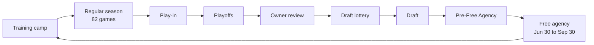

# Feature map

What Basketball Manager has today, how the pieces fit together, and where each one lives in the code. Check here before building on or changing a feature, and keep it current when features are added, moved or removed.

- `docs/SPEC_STATUS.md`: the spec, point by point, with status.
- `docs/HANDOFF.md`: the product spec and the rules the engine follows.
- `CHANGELOG.md`: what changed and when (shown in the game as "What's new").

_Last reviewed: 2026-10-07 (stat floors for the worst passers, rebounders and defenders; slower cap growth; new player value curve, bench players near the minimum; one-year minimum deals; playoffs banner under the Finals, smooth scrolling; true potential fixed and a hard cap, growth calibration; ratings max 99, 99 improbable for every rating; box score starters/bench bar; smaller saves, faster long leagues; 99s extremely rare, diminishing returns; free throws at both ends, 100 = 98%; FA Last team column; roster Starters / Bench bar; size at the rim; Selfish trait rebalance; movable menu tabs; AI ticket prices by owner type)._

## How it fits together

There's no server. The whole game runs in the browser, saves to IndexedDB and is hosted as a static site on GitHub Pages. Almost all of the logic sits in one engine object (`src/engine/Game.ts`). Screens read their values from the view model (`src/ui/viewModel.ts`) and call engine methods for actions; the engine notifies React through `subscribe` / `useSyncExternalStore` (`src/App.tsx`).

| Layer | Where | Notes |
|---|---|---|
| Entry and autosave | `src/main.tsx`, `src/App.tsx` | Title screen or open league; autosaves 700 ms after a change and when the tab is hidden |
| Shells and routing | `src/ui/GMView.tsx`, `src/ui/shell/` | Three layouts: Almanac (sidebar), Broadsheet (masthead), Desk (icon rail). Menu tabs are movable in all of them (drag, or Arrange mode's arrows; `navLayout.ts` keeps the order and sections in localStorage, `shell/navDnd.ts` handles the drag) |
| View model | `src/ui/viewModel.ts`, `src/ui/vm.ts` | Menu (`NAV`), phase bar actions, every screen's values |
| Engine store | `src/engine/Game.ts` | `db` (players `db.P`, schedule, caps) is mutated in place; `state` is replaced through `setState` |
| Saves | `src/db/saves.ts` | One IndexedDB row per league (`Game.toSave()`); export/import as JSON |
| Player cards | `src/db/cards.ts` | The card library, shared by every league in the browser (IndexedDB `meta` row `cards`); a league's old `s.cards` join it on open (`App.tsx`) |
| Hosting | `.github/workflows/deploy.yml`, `scripts/deploy-pages.sh` | Every push to the development branch builds and pushes `dist/` to the `gh-pages` branch (GitHub Actions); `npm run deploy` does the same by hand |

## The season loop

Each step is a button on the phase bar (`phase` in `state`). After free agency the loop goes back to training camp.

| Step | `phase` | What happens | Code |
|---|---|---|---|
| Training camp | `preseason` | Summer development (ratings move, ceilings re-estimated, hidden gems surface), retirements, a new class of about 100 prospects, expansion. You cut to 15 standard + 3 two-way contracts. Opening night: short rosters filled with minimum deals, media predictions locked, AI extensions, fire sale if the owner's payroll order is unmet. | `Game.startPreseason()`, `Game.startSeason()`, `progress.ts`, `media.ts` |
| Regular season | `regular` | 82 games, late October to mid-April. Sim a day/week/month/to the deadline/to the end, or watch live. AI teams trade, sign and waive (35% chance a day). Injuries, fatigue, monthly development and scouting reports, mentoring. All-Star Weekend mid-February, trade deadline early February. | `Game.sim()`, `Game.simDay()`, `sim.ts`, `allStar.ts`, `cbaFlow.seasonTick()` |
| Play-in | `playin` | Awards announced. Each conference: 7 v 8, 9 v 10, then the game for the 8 seed. | `Game.startPlayin()`, `Game.simPlayin()`, `awards.ts` |
| Playoffs | `playoffs` | Best-of-7 East and West, then the Finals. When it ends: the owner's year-end letter and the Hall of Fame vote. | `Game.startPlayoffs()`, `Game.simPo()`, `ownerLetter.ts`, `hof.ts` |
| Owner review | `playoffs` → `lottery` | Incentives paid, owner verdicts (you can be fired), your GM contract, the job market. | `frontOffice.seasonReview()`, `gmCareer.ts` |
| Draft lottery | `lottery` | 3-2-1 lottery (16 teams, all 16 picks drawn), 2nd-apron penalty, pick protections and swaps settle. | `Game.runLottery()`, `lottery.ts`, `pickRules.ts` |
| Draft | `draft` | Two rounds, 60 picks, rookie-scale deals, draft promises and draft-night heists. | `Game.aiDraft()`, `Game.draftPick()`, `cbaFlow.signDraftee()` |
| Pre-Free Agency | `draft` (with `preFA`) | Player options decided; you decide team options, expiring contracts (re-sign, keep Bird rights, qualifying offer, renounce) and extensions. | `preFA.ts`, `PreFAScreen.tsx` |
| Free agency | `fa` | New league year (cap grows, exceptions reset, team sales close), moratorium until July 6, offer sheets, owner payroll orders. 92 days. | `Game.startFA()`, `Game.advanceFA()`, `cbaFlow.ts`, `contracts.ts` |

## Feature areas

### Game simulation
- One possession-by-possession engine plays every game, watched or simmed.
- Tuned to the 2025-26 NBA (Basketball-Reference league averages: pace 99.4, 115.6 points, 89.1 FGA, 37.0 3PA, 23.5 FTA, 14.5 TOV; `sim.ts` `BASE`, `RATE`, `CAL`) and to its spread: team scoring about 105–125 (2025-26: 105.9–122.1), team ORtg, eFG%, TOV% and net rating spreads, win totals, single-game margins and home court (about 2.5 points). The spread comes from `TOV_K` (how much a lineup's handling and the defense's pressure move turnovers), `LINEUP_REG` (part of a lineup's shooting edge given back to defensive attention, players' differences intact), `LEAD_K` (a big lead relaxes the leader, urgency lifts the trailer; earlier garbage time), the softer `CURVE` downside, lighter lineup defense and IQ terms, and AI teams' own tempo (`Game.tempoOf`: coach's taste plus roster speed and age, about 97–104 possessions). League norms re-center ratings every season.
- Playing style (`tendencies.ts`): every player has nine stored shot tendencies, only the shot categories NBA.com tracks, each in its NBA unit: usage rate (USG%, advanced stats); the five shooting zones (Restricted Area, In the Paint (Non-RA), Mid-Range, Corner 3, Above the Break 3) as shares of his shots; Catch & Shoot and Pull-Up (shot dashboard: 10+ ft jumpers with no dribble / off the dribble) as shares of his shots; and free throw rate (FTA per FGA, a four factor). Stored as 0–100 scores (`p.ten`, `tenV: 3`, centered on the league: 50 = typical). Display: the zones through his whole shot mix as the engine plays it (`zoneShares`, adding up to 100%), catch & shoot and pull-ups as a split of his 10+ ft jump shots (`jumpShares`; about 8% count as neither), free throw rate on a scale fitted to what players actually shoot (`UNIT.ftr`), usage through the engine (`expUsg`). Each drifts toward a target set by his skills (read against the rest of his game), role, personality and age, plus a fixed personal quirk: a summer step after development and a small monthly step in season; young players adapt fastest, aging bodies get to the rim and the line less. The engine plays them (`effTend`): the zones set his shot mix (`shotProfile`; the paint and mid-range share the engine's mid tier, and each mid-tier shot is played as a paint floater or hook (`ka`/`km` in box scores, a little easier, rim touch counts) or a mid-range jumper, `PAINT_SHARE`), catch & shoot against pull-ups how often his makes are assisted, free throw rate his share of the team's shooting fouls (`FTR_K`), usage how much he shoots. Turnovers and who gets the assist come from ratings. There are no hand-set multipliers any more: older saves' God Mode fine-tuning and player cards' multipliers become the same change on his tendencies (`applyMult`); cards carry tendency scores (`ten`). Shown on every profile (grouped: shot volume, shooting by zone, shot dashboard, the line) with this season's actual numbers where the box score keeps them; editable in God Mode in NBA units (zones and jump shots by share, the rest adjusting). Older saves move over once (`db.ten3`, retired players too) and the league norms are recomputed. Shot volume is two parts (`sim.ts` `usageRaw`): what his offensive game earns right away (`offAbility`: scoring and creation, not his overall, so defensive specialists aren't fed like scorers) times the usage tendency, which carries role, confidence and habit. Its target (`tenTargets`) reads his offensive level against the league, an elite scoring weapon, scorer vs stopper, his rank among his team's options, the team's direction (`Game.strategies(…, true)`: young players get the ball on rebuilding teams, wait on contenders), passing, age and personality (Egotistic, Ball-dominant and Selfish players want more and a weak game pulls them down only half as much; Team players less); young players grow into a bigger role faster, a fading game loses its shots faster unless the ego won't let go. Older saves re-target usage once (`db.usgV`). Hand-set multipliers (God Mode, player cards) sit on top and fade 25% a summer unless locked (`p.tenLock`). Shown on every profile (Playing style, with this season's actual USG%, 3PA rate and mid-range share where recorded); editable in God Mode in NBA units.
- Four shot tiers (rim, mid-range, corner 3, above-the-break 3; five zones in the UI), usage-based shot selection, Four Factors clutch tiebreaker. Rim finishing counts size (`sim.ts`): rim skill (`zoneSkill`) weighs Height 25% plus wingspan, a direct size edge on every rim shot (`RIM_SIZE` × height rating vs `norms.rimHgt`, the league's rim-attempt-weighted height), rim protection scaled up for small finishers, and more blocks against them; small guards finish about 64% at the rim, 7-footers about 73%. Older saves re-center the rim norms once (`db.rimV`). Free throws (`sim.ts` `curve('ft')`, `CAL.ft`): 60 is about 80%, 90 about 90%, 98 about 92% (Curry, Nash: `soft` flattens the top less than other shots); a perfect 99 is its own tier at 98% (`FT_PERFECT` 98.5, `ftPct`; Calderón's record 98.1%), capped at 99% instead of 95%; below 40 each point costs 0.75% instead of 0.5% (`FT_KNEE`, `FT_LOW`), so 20 is about 55% (Shaq) and 1 about 41% (Ben Wallace); floor 30%. Older saves re-center the free throw norm once (`db.ftV` = 2).
- Tactics: pace, offense and defense schemes, lead and trail presets, schemes unlocked by player roles.
- Who gets the assists, rebounds, steals and blocks: weighted by skill (`sim.ts`: passing, `rebSkill`, `stealSkill`, `blockSkill`), with floors (`PASS_FLOOR` 30, `REB_FLOOR` 36, `STEAL_FLOOR` 32, `BLOCK_FLOOR` 30) so the weakest players in real minutes still pick up NBA-like minimums (about 0.5+ assists, 1.5+ rebounds, 0.4+ steals in 20 minutes). Team totals are unchanged.
- Fatigue, minor and major injuries, home and road splits, personality effects (selfish, clutch, crowd-fed). Selfish (`pers.padder`, `SimPlayer.selfish`): 1.3× usage, a slight cut to his share of assists (passer weight ×0.85), and team costs: his team's assist rate ×0.9 on teammates' makes while he's on the floor, his own makes ×0.85 as likely to be assisted, teammates −1.5% FG and the defense +1.2% against him.
- Live game: scoreboard, box score, play-by-play, five speeds, step or sim to the end.
- Box score for every game (`BoxScoreModal.tsx`; an unlabeled accent bar splits each team's starters from its bench); per game, totals, per 36, shooting and advanced stats; league leaders; a ring by every season a player won the title (`hof.ts` `titleYears`: the champion's roster at the final buzzer, kept as `history[].ring`; older seasons fall back to a playoff line for the champion). Team history and the Hall of Fame count titles with it.

- League leaders (`LeagueLeadersScreen.tsx`): the top 10 in every box-score, shooting and advanced stat for any season, per game or totals, by the bold numbers' qualifying rules (`leaders.ts` `leaderBoards`); your players highlighted in your team's primary color (the team you're running now, `vm.ctx.meColor`; this season: on its roster; earlier: played for it that year).

Screens: Live game, Box score, Stats, League stats, League leaders, Tactics. Code: `sim.ts`, `tactics.ts`, `norms.ts`, `advanced.ts`, `leaders.ts`, `ui/live/`.

### Season and league
- 30 teams (15 per conference), 82 games, standings by conference or division. New leagues include the Iŋaliq Ivories (Little Diomede, Alaska) and the Wazíbló Dragoons (Pine Ridge, South Dakota) in the Northwest, each with a hand-drawn crest (`ui/teamCrests.tsx`, used by `TeamLogo` unless a logo style is picked in the League editor); Tampa and Phoenix are expansion options (`franchises.ts`). Their CCP clubs: `ccp.ts` `ccpAffilOf` (Denver's moves to Window Rock, and the Little Diomede club sits out).
- All-Star Weekend in mid-February, trade deadline in early February.
- Play-in, East and West best-of-7 brackets and the Finals, with "if the season ended today" views; when the Finals end, the champion's banner hangs right under the Finals series, inside the Finals column (`ChampBanner.tsx`). Game chips under each series have no dotted underline (a hundred of them made scrolling stutter); they underline on hover.
- Awards voted by editable formulas: MVP, DPOY, ROY, 6MOY, MIP, Finals MVP, All-League, All-Defense, All-Rookie and more; the Awards screen highlights your players (and you as Coach of the Year) in your team's primary color (`meColor`; text dark or white by contrast, `kit.tsx` `inkOn`).
- Media preseason predictions and a press room.
- Hall of Fame (3-season wait, up to five a year), league history, league-wide transactions.
- Expansion from 45 ready-made franchises or your own design, with an expansion draft.
- Team history (`TeamHistoryScreen.tsx`), for any team, every section foldable (`s.thFold`). Overall and Seasons come from league history (`s.history[].teams[tid]`: record and finish) plus this season so far; a season's year opens the Roster on that team and year (`s.rosterAt`, read once by `RosterScreen`). Championships: a banner per title (`ChampBanner.tsx`, also under the Finals on the Playoffs screen). Players: everyone who has played for the team, his regular-season line there (PER minute-weighted, EWA summed per season as `advanced.ts` counts it), titles there (`titleYears`) and last season, rows colored by where he is now with a key (`kit.tsx` `HL`: on the team now (your team's primary color on the team you're running, lavender on any other), active elsewhere, Hall of Fame). Retired jerseys: you retire a former player's number from his row (teams you run; any team in God Mode), stored on the team (`t.retired`: num, pid, season) by `jerseys.ts` `retireJersey`/`unretireJersey`. `assignNumbers` keeps retired numbers from newcomers (a current wearer keeps his); each season's stat line records the number worn (`row.num`, read by `numsWith`).

Screens: Dashboard, Standings, Schedule, Playoffs, Awards, Predictions, Hall of Fame, Press room, Transactions, Team history. Code: `Game.ts`, `awards.ts`, `formula.ts`, `allStar.ts`, `media.ts`, `hof.ts`, `txlog.ts`, `jerseys.ts`.

### Roster and coaching
- Rotation by drag and drop, starters, per-player minute targets, keep sorted, play through injuries. A Starters / Bench bar (`RosterScreen.tsx` `BenchBar`) sits between the fifth starter and the bench in the current season; drop a player on it to make him first off the bench.
- Injuries count games and days (`Game.injUntil`, `injText`, `calNow`): games with his team's games (play-in and playoffs too), days on the calendar, summer included. Free agents heal on the calendar (`healIdle`). On a team you run, an injured player drops to the end of the roster and returns to his old spot and minutes when healthy (`injAway`/`injBack`), unless you moved him yourself while he was out (a manual move clears `p.preInj`): then he stays where you put him. Signings and trades in between don't stop his return.
- Depth chart and the assistant coaches' lineup advice with one-click apply.
- 20 ratings (including acceleration, layups, box-out, blocks, steals), measured wingspan, badges (on profiles, free agency and Tactics, not the Roster; a profile shows seven, "+N more badges" shows the rest).
- Development environment (`environment.ts`): coaching and facilities (yours from Finances; an AI team's from its owner type, `teamBudget`), playing time for players 24 and under, the locker room and a mentor. They combine with diminishing returns into one multiplier, capped at ±25% and weighted toward players with modest potential, and they never raise a ceiling. A player's role in games (`roleReps`, from his season stats) leans where his growth goes. Every team reads potential through its own scouts (`Game.potRead`, `teamRead`; your screens show yours) in the draft, trades (`pVal`), re-signings and extensions. AI teams' medical staffs follow their owners (injury recovery). Monthly reports and the year-by-year notes say why (`envWhy`, `planStatus`, `roleLead`). The yearly form roll includes timing, so breakouts are partly given back the next year. Shown on the Development tab (your players; God Mode: anyone).
- True potential (`potential.ts` `trueT`, `p.tpot`) is fixed: set once in `initCeil` (his planned peak ÷ `TYPICAL`, plus a hidden gem's full add in `intangibles.ts` `rollGem`), never moved by events (`moveTruePot` is a no-op), only by God Mode (`setTruePot`, or an edit that lifts his overall past it). His overall is hard-capped there (`capToT` after every growth step; the yearly and monthly targets and body growth stop at it); skill ceilings only shape where growth goes (`skillTop` no longer reads them). The plan aims at it (`planRate`). The league's read (`p.pot`, `refreshPot`) is what he could still reach (`reachOf`, minus a gem's unsurfaced part) plus the scouts' miss, between his overall and his true potential; your staff's and other teams' reads are capped there too. Growth calibration (`Game.REALIZE` 0.94, `Game.GROW_CAP` 2.5: work ethic × hidden factor^0.6 × breakout year × environment together; `devMult`): about 8 players at 75+ and 15–20 at 70+ in a 30-season test. Older saves set true potential once from the full ceiling (`db.tV`).
- Potential (`potential.ts`) is a ceiling, not a destination. Each player has hidden ceilings per skill and a development plan from his first season to about 27. His hidden pace decides how much of the plan he gets, and a lost year is never made up. True potential (`p.tpot`) is what he could still reach if everything goes right. The potential shown (`p.pot`) is the league's scouting read of it: off by a few points for prospects, sharpening each season. AI teams use that read; your staff reads your own players closely. God Mode shows the truth: the profile ring ("True potential"), tables, the draft board, and on the Development tab the skill ceilings, full ceiling, pace and hidden gem. The editor's True potential field (and a player card's potential) sets it exactly, 1 to 100 at any age (`setTruePot(p, T, true)`): skill ceilings fit up to 100 (normal fits stop at 99), whatever his ratings can't show (height and frame don't grow) is held as God Mode's word (`p.godPot`, a floor on the full ceiling that injuries and gems still move), a veteran gets a three-season plan (`dv0.n`, on which `Game.devRate` grows him past 29), and a down year can't turn a God-set plan negative (the form roll floors at 0).
- The top of the rating scale (`ratings.ts` `RMAX` 99, `softTop`/`SOFT_SCALE`, `skillTop`; `potential.ts` `ceilFor`/`genOf`; `development.ts` `dimAt`): every rating stops at 99 (God Mode editors, cards, generation, height and wingspan ratings too). Skill ceilings past 85 thin out slowly (a raw target of 110 lands about 93, 130 about 96) and level off below 98; growth stops at 98.4 for skills and the body (`skillTop`, applied in `skillChange` after spreading growth, the summer noise step and `develop` for the body). A 99 comes only from a breakthrough (`Game.BREAK` 1/150 a summer league-wide, split among the ratings sitting at 98 (age 31 or younger), so about once in 150 seasons; `p.brk`, logged in league news) or a generational skill (`p.gen`, rolled once in `initCeil`, `GEN_RATE` 1 / (138 × 10,500): one 30-season league in 138; ceiling about 96–99.4). Growth has diminishing returns past 70 (`dimAt`: two thirds at 75, under half at 80, 30% at 85, 19% at 90, 12% at 95; past 80 for a generational skill), the rest spills to his other skills. Generated ratings (body too), derived Blocks/Steals and training-camp jumps follow the same top (camp never hands out a 98+). Older saves bring ceilings down once (`db.topV`) and anything above 99 to 99 (`db.r99V`).
- Undrafted and fringe players (`potential.ts` `fringePeak`/`makeFringe`, used for the CCP's pool, tryouts and CCP draft): their expected peak comes from a ladder. About 99% stay fringe, about 1 in 100 becomes a bench player, about 1 in 500 a starter, and the top rungs are rarer still; younger players can climb further. Hidden gems for them are role- or starter-sized (a star is the ladder's call), and the league's read of their potential is rougher. Draft leftovers keep their prospect ceilings, gems and NBA translation. Players without an NBA team (CCP, abroad) develop on their plan monthly (`Game.devIdle`), with CCP reps or minutes abroad in their environment (`environment.ts`). The summer free-agent cleanup keeps the draft's 20 best undrafted rookies.
- Player development (`development.ts`): how much a player grows is set in `Game.ts` (age, room under potential, hidden development factor, work ethic, form, minutes, coaching); where it lands is his own hidden development profile. Specialists pour growth into one area, others grow two or round out, and the direction carries from year to year. Skills he isn't working on stall or slip. His body has its own track: athletic peak 26–29, frame limits on strength and stamina, and young players arrive with their athleticism mostly there. Coaching is a capped multiplier (at most +12%), and training focus decides where growth goes. Your players' Development tab shows "How he develops".
- Training focus per player, hidden decimal growth, monthly development reports, year-over-year progress.
- Locker room morale; veteran mentors who pass on or remove traits.
- Player moods with every factor explained on hover; jersey numbers.

Screens: Roster, Depth chart, Development, Tactics. Code: `assistants.ts`, `coaches.ts`, `lockerRoom.ts`, `ratings.ts`, `development.ts`, `progress.ts`, `jerseys.ts`.

### Contracts and trades
- Salary cap, luxury tax with repeater rates, 1st and 2nd aprons, salary floor.
- Max and minimum by service, rookie scale, full / early / non-Bird rights, cap holds.
- Exceptions: MLEs, room, bi-annual, minimum, disabled player; hard caps.
- Two-ways, Exhibit 10s, 10-days, hardship; waive, stretch, buyouts, waiver claims.
- Trades: both rosters filter by position (PG/SG/SF/PF/C, hybrids count for both spots; players in the deal stay listed) and sort by a Pos column (`TradeScreen.tsx`); salary matching by apron, trade exceptions, kickers, no-trade clauses, pick protections and swaps, assistant GM advice, shopping a player for offers.
- Pre-Free Agency: options, qualifying offers, re-sign or renounce, extensions.
- Free agency on the NBA calendar: moratorium, restricted free agency and offer sheets. The free agent list has a sortable Last team column (`txlog.ts` `lastTeam`: the latest of his transactions and the seasons he played; "(drafted)" when only his draft rights were there; — if he was never on an NBA team), with the team's logo, linking to the team.
- Cap outlook: real cap history since 1984-85 and a 500-season projection (`capModel.ts`: about 4% a year early on, settling near 2–2.5%; smaller media-deal bumps).
- What players ask for: `valueCurve` in `Game.ts` (used by `Game.fair`, scaled by the league's salary scale `db.sf` and the cap): bench players (48 and below) ask about the minimum, the money goes to starters and stars. `askOf` (`cbaFlow.ts`) adds age and mood. Contract length: `prefYears` (`contracts.ts`) by age and role (under 48 one year, under 52 up to two, under 56 up to three); AI minimum deals are one year (two for 23 and under).

Screens: Trade, Pre-Free Agency, Free agency, Cap sheet, Contracts, Cap outlook. Code: `cba.ts`, `cbaFlow.ts`, `contracts.ts`, `capModel.ts`, `pickRules.ts`, `tradeAdvice.ts`, `tradeOffers.ts`, `preFA.ts`.

### Scouting and draft
- Scouts with regional specialties; talent regions in tiers 1 to 4; the scouting budget sets accuracy.
- Scouting reports with margins: 12 graded categories, strengths, weaknesses, player comparisons.
- Scout briefs: tell a scout what to look for and he finds players himself.
- Shortlist, draft board and mock drafts; about 100 prospects a year, 60 drafted.
- 3-2-1 lottery with exact odds and a lottery-night reveal.
- Draft promises and draft-night heists.
- Draft surprises: each prospect has a hidden "NBA translation" that shows at his first training camp. His level moves (about half ±2, the rest 3–6 either way, about one in eight a real bust or steal), his shape shifts (e.g. shooting up, playmaking down), and his ceiling moves too. You get a camp report; God Mode profiles can peek. The level change moves his development plan's starting point with it (it's a level, not growth still to come).
- Draft class lists (from a player's draft line): Current team and Drafted by (`godMove.ts` `nowLabel`, `draftedBy`).
- Past drafts: every pick of every draft held in the league, with draft-night rating, first camp, rating now, career line and where he is.
- Overseas market: buyouts, league-strength translation, redemption arcs, 15-game adjustment.
- CCP development league and G League affiliates with call-ups.

Screens: Scouting, Shortlist, Draft (with Past drafts), Lottery, Overseas, CCP. Code: `scoutReport.ts`, `scoutBrief.ts`, `lottery.ts`, `translation.ts`, `overseas.ts`, `ccp.ts`, `gleague.ts`, `txlog.ts` (`pickUsed`).

### Owner and career
- Finances: revenue, ticket price, coaching / health / facilities / scouting budgets on sliders with Auto; ranks compare with what AI clubs actually spend and charge.
- AI clubs' budgets (`frontOffice.ts` `aiBudget`): staff and facilities from the owner (`environment.ts` `teamBudget`); ticket price from demand and owner type (`aiTicketPrice`: Frugal fills ~88%, Hype Focus ~99%, others ~93–94%, plus a per-team quirk). Demand uses `demandWp` (.500 before the season, the record fully from game 30).
- Five owner archetypes with made-up named owners, biographies and a directory; team sales.
- About forty owner backgrounds (how the money was made and how they got the team: bought, inherited, founding partner, local group), never two the same in a league, stored on the team (`ownerBg`).
- Owner reviews, year-end letters, payroll orders and opening-night fire sales; you can be fired.
- You as the GM: name, nationality, experience, headshot, your contract and extensions.
- Job market: vacancies, applications, offers, switching teams.
- Player incentives (likely and unlikely), stat-padding dilemmas, press quotes.
- League finances (`LeagueFinancesScreen.tsx`): every team's market size, attendance, ticket price, revenue and profit (this season's projection, `financesOf`), payroll, cap space, open roster spots, AI strategy (`Game.strategies`) and budgets (`teamBudget`), sortable, your team (the one you're running now) highlighted in its primary color; Trade with opens the Trade screen on that team. The game models market size, not population, and keeps no team cash, so those two columns of the reference are Market and left out.

Screens: Finances, Owner, Career, Press room, League finances. Code: `frontOffice.ts`, `owners.ts`, `ownerLetter.ts`, `gmCareer.ts`.

### World and players
- 215 countries with population groups, name pools, cities, flags and scouting regions.
- Native-script names next to romanized ones (`heritage.ts` `nameFromGroup`): only when both parts come from pools in the same script (`SCRIPT`), the country writes names that way (`COUNTRY_SCRIPTS`; a player born abroad in another-script country gets none, `Game.bio`), and every name in such a pool has its verified native form (`nativeScripts.ts`, 34 pools; names without one leave the pool). Groups listing the same pools for both parts take both from one (`MIX_OK` exceptions). Gulf states count citizens. India by language community, with Indian Muslims and Malayali Hindu/Christian families apart. Latin only on purpose: Oromo (written in Latin), Eritrea's Tigrinya names (Ge'ez spellings not verified yet), Indian Muslims and Sri Lankan Moors (`names.ts` `orm`, `er`, `inMu`, `lkm`).
- Heritage, birthplaces and hometowns; national-team eligibility.
- Personality traits (Egotistic, Clutch, Selfish, Streaky and more), hidden intangibles and hidden gems.
- American names from the U.S. Census Bureau's 2020 Census name tables (`src/data/usCensusNames.ts`, generated): about 3,000 first names and 5,000 surnames for African American players (`usb`), 1,500 and 6,000 for white American players (`usw`), weighted by real frequency per group, first names leaned toward today's players' generation (by each name's share of the young "two or more races" population). `heritage.ts` reads them as weighted lists (`decodeWide`/`drawWide`); a curated core of current player names (the Jalen family with its spelling variants, `FIRST_WEIGHT`) supplies one given name in five (`CORE_F`); `americanFirst` serves North-American-born children of immigrants.
- Ready-made player cards: Luka Dončić plus seven rookies (Knecht, Simmons, Horford, Paul, Thompson, Leonard, Howard), each tuned against his real rookie season translated to today's league.
- Families: sons and brothers of former players.
- Faces (`faces.ts`): `makeFace` describes a face as JSON from the player's face seed mixed with the league's seed (the same id looks different in every league), his age (grey, receding hairline, lines; `Game.face` redraws on a birthday) and a relative's face (`Game.kinFace`: father, else eldest brother). Head shape (superellipse cranium, cheeks, jaw, chin), seven eye shapes, six brow shapes, nose, lips, ears, skin tone on a continuous ramp with undertones, about 35 hair styles picked by hair texture (not by race), 15 facial-hair styles, six expressions, dyed hair and highlights for anyone (about 9%), and accessories at set rarities: headbands ~13%, earrings ~19%, nose studs ~3.5%, nose rings ~1.3%, lip and eyebrow rings ~0.7%, glasses ~0.4%, face shields ~0.3%; freckles, moles, neck tattoos, undershirts. `faceSvg` draws layered SVG lit from the upper left, shading with translucent layers (no gradients, filters or ids, so a face can repeat on a page).
- New Face and Edit face under the profile portrait, in normal mode too (`ProfileMain.tsx`, `FaceEditor.tsx`): edits are stored as `p.faceX` ({ 'hair.style': … }) over the generated face; New Face rolls a new `faceSeed`. God Mode can still upload a headshot (`GodPlayerEditor.tsx`).
- Retirements and an optional retirement age.

Screens: player profile (Overview, Contract, Development, History, Comparison), country lists. Code: `src/data/`, `eligibility.ts`, `family.ts`, `faces.ts`, `FaceEditor.tsx`, `traits.ts`, `intangibles.ts`.

### Control and saves
- Run 1 to 30 teams: My teams dashboard, switch teams, take over or hand a team to the AI.
- God Mode: edit any player (ratings, bio, traits, injuries; Freeze attributes beside −1/+1 all stops every development change to his ratings, `p.frozen`: monthly and summer growth or decline, idle development, the camp translation and injury losses, while aging, injuries, healing and moods go on), team and league editor (names, colors, logos, arena, cap), force trades, daily schedule, player cards. The card library is shared by all leagues (`db/cards.ts`); applying a card changes only that league's player.
- God Mode player management (Edit player): Delete (with a confirmation; `godPlayer.ts` `deletePlayer` clears him from every list, offer, watch list, club map and family, and leaves the name-only `gone` stub old records read), Clone (`clonePlayer`: a new id with his ratings, body, background, personality, tendencies and face, none of his history, into free agency or his draft class), and NBA family (father, brothers, sons as linked player records, both ways: `family.ts` `setFather`/`addSon`/`addBrother`/`unrelate`/`relateBlock`; picked with `ui/PlayerPicker.tsx`).
- God Mode owner powers: the owner has nothing over you (no firing, payroll orders, fire sales or meddling; your contract renews itself). Signing a player: the Sign button follows every rule in God Mode too (cap, exceptions, roster, contract rules, the player's answer); Force Sign (`cbaFlow.userSign(g, true)`) is the one way past the salary cap, the roster limit and an overseas buyout clause (his club gets its asking price): he signs on your terms and a cap method he couldn't use becomes a plain God Mode contract (no exception spent, no hard cap). Over the roster limit in season, no game can be played until you cut (`Game.rosterOver`/`canPlay`, checked by `sim`, `simPlayin`, `simPo` and every Watch button; the sim buttons grey out with a note). Roster size (God Mode, Settings): season maximum 10–20 and opening-night minimum 8 up to the maximum, the offseason limit six above the maximum (`cba.seasonMax`/`rosterMin`/`campMax`, stored as `s.rosterLim`); `Game.setRosterLimits` trims AI teams over a lowered limit at once and, in season, fills short ones. Edit any owner (type, kind, background, worth, purchase, bio) or force a team sale; move any player to any team from his profile (`godMove.ts`).
- Easy mode: hand off lineups, tactics, contract paperwork, free agency and roster decisions (opening-night trim to 15), draft picks, firing, scouting, injuries.
- Trades (`tradeLogic.ts`): salary dumps (AI to AI, and AI offers to you) only take `badContract`s: never rookie-scale deals, young players judged on their projection; sweeteners are a team's least valuable young players, never a top-14 first-rounder (`throwIn`).
- Trades (`tradeLogic.ts`), more: team outlook (projected strength from roster, ages, contracts and record) sets future picks' expected slots, with uncertainty that grows by year; picks are worth their expected value (`pickWorth`), swaps the expected gain (`swapWorth`). Bad contracts cost the receiving team by its cap situation and timeline (`contractK`, `contractValue`). AI-to-AI trades need a reason (`aiTradeIdea`: contender buys, salary dump, need for need) and run in season and in free agency; AI teams bring you offers (`offerToUser` → `s.inOffers`, Trade → Offers to you); each offer's pop-up (a notice with `offerId`) has View Trade Offer, which opens that offer on the Trade screen (`vm.inOffersV.openId`). God Mode sets how many drafts ahead picks trade (`s.pickYears`, default 4; `Game.ensureAssets`).
- Roster decisions (`rosterAI.ts`): AI cuts, waivers, the summer trim to 21, rookie team options and your staff's opening-night cuts keep the players worth most to the team (`rosterValue`: ability, the team's read of upside, trajectory, timeline, role, position depth, unique skills, guaranteed money, draft investment). AI rotations give young high picks development minutes (`devMinutes`).
- Tutorial (quick or in-depth) and What's new from the changelog.
- Three layouts, light and dark themes, team-color accents, player search.
- Autosave to IndexedDB, many leagues, JSON export and import; worst-roster start option (`Game.swapToWorst`: the lowest team rating, then `thinProspects` trades its 23-and-under players with 56+ true potential one for one, same position group and similar salary first, to other teams or free agency for veterans with little upside and no higher a rating; one under 64 may stay; it stays the weakest roster, and the first pick gets the very worst); most-hopeless-roster start option (`startRoster.ts`: the most stuck of the ten weakest rosters by `hopelessScore` (rating, age, overpay × years, young upside), then no prospects, an old rotation, three to five bad contracts on mediocre veterans to the luxury tax, its best guard traded for a weaker big or wing, bottom five in rating; `hopelessPicks` gives this season's and a future first (and a second) to contenders; `hopelessReport` writes the welcome notice; the start screen shows the roster it starts from, `Game.preview` `hopeless`).

Screens: My teams, Settings, League editor, Player cards, Daily schedule, Tutorial, What's new. Code: `easy.ts`, `playerCard.ts`, `GodPlayerEditor.tsx`, `Tour.tsx`, `db/saves.ts`, `db/cards.ts`.

- Spectator Mode (`spectator.ts`, `SpectatorDashboard.tsx`): no team is yours. `enterSpectator` empties `s.managed` (so `isUser` is false for every team and the AI runs all of them) and sets `s.spectator`; your clubs' front-office records go to `s.clubArchive`. While spectating, `clubOf`/`clubPatch` ignore `s.me`, `addNotice` adds nothing, there are no trade offers to you (`simDay`), owner letters, GM contract decisions or job offers (`seasonReview`), and `startFA` doesn't wait on Pre-Free Agency decisions. `spectate(goal)` drives the season: a step, days, the end of the regular season, the draft, the next opening night or N seasons (each ends when a champion is crowned); `stopSim` stops it. The season bar, sidebar and the Spectator dashboard (standings with playoff/play-in lines, champion, leaders, injuries, latest moves, champions) offer the goals; management screens leave the menu. `manageTeam(tid)` ends it (from Manage a team…, a team's page or Settings): the team's archived records return or it starts fresh, a league that began spectating sets up the GM first, and `graceY` keeps the owner from firing you over the season you joined. Start: the title screen's Spectator Mode option (`Game.create(..., { spectate })`) or Settings.
- Player profile: Trade (above Release, your players) opens the trade screen with him on your side (`Game.playerToTrade`). Transactions: a league-year picker (years split at each free agency's salary-cap line) and an Injuries filter.

## Menu screens

The menu is `NAV` in `src/ui/viewModel.ts`; `GMView.tsx` picks the component. Screens marked † appear only in God Mode (My teams also appears when you run more than one team).

| Group | Screen → file (`src/ui/screens/` unless noted) |
|---|---|
| Team | Dashboard → `DashboardScreen` + `InboxCard` · Schedule → `ScheduleScreen` · Roster → `RosterScreen` · Depth chart → `DepthChartScreen` · Development → `DevelopmentScreen` · Tactics → `TacticsScreen` · Finances → `FinancesScreen` · Cap sheet → `CapSheetScreen` · Contracts → `ContractsScreen` · Team history → `TeamHistoryScreen` |
| Management | Trade → `TradeScreen` · Pre-Free Agency → `PreFAScreen` · Free agency → `FreeAgencyScreen` · CCP → `CcpScreen` · Draft → `DraftScreen` + `MockDrafts` · Shortlist → `ShortlistScreen` · Scouting → `ScoutingScreen` + `ScoutReportsSection` · Overseas → `OverseasScreen` · Owner → `OwnerScreen` · Career → `CareerScreen` · Player cards† → `CardsScreen` |
| League | My teams† → `MyTeamsScreen` · Standings → `StandingsScreen` · Transactions → `TransactionsScreen` · Playoffs → `PlayoffsScreen` · Awards → `AwardsScreen` + `AwardFormulas` · Predictions → `PredictionsScreen` · Hall of Fame → `HallOfFameScreen` · Stats → `StatsScreen` + `LeagueStatsScreen` · League leaders → `LeagueLeadersScreen` · Cap outlook → `CapOutlookScreen` · League finances → `LeagueFinancesScreen` · Settings → `SettingsScreen` + `RetirementSetting` + `ExpansionPicker` · Tutorial → `ui/Tour.tsx` · What's new → `ChangelogScreen` · League editor† → `LeagueEditorScreen` · Daily schedule† → `DailyScheduleScreen` · Press room → `PressScreen` |
| Not in the menu | Live game → `LiveGameScreen` + `ui/live/` · Play-in → `PlayinScreen` · Lottery → `LotteryScreen` · Title screen → `ui/TitleScreen.tsx` · Pop-ups → `ui/modals/` (player profile, team, box score, contract, owner letter, GM setup, God Mode player editor, card library, notices, confirm) |

## Engine modules

All in `src/engine/`.

| Module | What it does |
|---|---|
| `Game.ts` | The league: world generation, the season engine, phase transitions, trades AI, injuries, development, draft; the observable store |
| `sim.ts` | Possession-by-possession game engine used for every game |
| `tactics.ts` | Every tactical setting and what it does in the engine |
| `norms.ts` | League normalization that keeps averages on the 2026 baselines |
| `ratings.ts` | Team rating and player badges |
| `ratingDist.ts` | Rating percentiles across the league |
| `advanced.ts` | Basketball-Reference-style advanced stats |
| `leaders.ts` | League leaders: the bold numbers, and the League leaders page's top-10 boards |
| `awards.ts` | Season awards from formulas |
| `formula.ts` | Safe expression compiler for award formulas |
| `allStar.ts` | All-Star Weekend |
| `hof.ts` | Hall of Fame eligibility and voting |
| `media.ts` | Preseason predictions: standings, win totals, title and award picks |
| `tendencies.ts` | Playing style: nine evolving shot tendencies per player in the NBA's tracked categories and units (usage, the five shooting zones, catch & shoot, pull-up, free throw rate), their targets, summer and monthly evolution, what the engine plays (`effTend`), and their display (`zoneShares`, `jumpShares`) |
| `development.ts` | Where development lands: each player's development profile, the body's own track, work ethic, the coaching multiplier |
| `potential.ts` | Potential as a ceiling: skill ceilings, the development plan and hidden pace, true potential vs the league's scouting read |
| `environment.ts` | Development environment: team budgets (AI teams' from their owners), the capped environment multiplier, role reps |
| `progress.ts` | Opening-night and end-of-season rating snapshots |
| `intangibles.ts` | Intangibles and hidden gems |
| `traits.ts` | Personality traits and their descriptions |
| `lockerRoom.ts` | Team morale and mentoring |
| `assistants.ts` | Assistant coaches' lineup advice |
| `coaches.ts` | Assistant coaches running a player's training |
| `easy.ts` | Easy mode switches |
| `tradeLogic.ts` | Trades: team outlook, pick and swap worth, contract cost, AI-to-AI trade ideas, offers to you, the pick-trading horizon |
| `rosterAI.ts` | Roster decisions: a player's worth to a team (`rosterValue`), who gets cut (`pickCut`), team options, draft investment, development minutes |
| `cba.ts` | The CBA: cap, tax, aprons, contract types, salary matching |
| `cbaFlow.ts` | The CBA through the league year: signings, releases, options, RFA, AI free agency |
| `contracts.ts` | Signing, accepting, waivers, stretch, buyouts |
| `capModel.ts` | Real cap history and the 500-season projection |
| `pickRules.ts` | Pick protections and swaps |
| `lottery.ts` | The 3-2-1 draft lottery and its odds |
| `preFA.ts` | Pre-Free Agency decisions |
| `tradeAdvice.ts` | Assistant GM's read on a trade |
| `tradeOffers.ts` | Trade offers when you shop a player |
| `txlog.ts` | Per-player transaction history |
| `frontOffice.ts` | Finances, owner reviews and firing, job market, press, incentives, payroll orders, fire sales, team sales |
| `owners.ts` | Who the owners are: how they made their money and what they're worth |
| `ownerLetter.ts` | The owner's year-end letter |
| `gmCareer.ts` | You as GM: identity and contract |
| `scoutReport.ts` | Scouting reports for any player |
| `scoutBrief.ts` | Scout briefs that find players |
| `overseas.ts` | Overseas market, league translation, scouting intel |
| `ccp.ts` | The CCP development league |
| `gleague.ts` | G League affiliates |
| `eligibility.ts` | National-team eligibility |
| `family.ts` | Sons and brothers of former players; God Mode's family-link editing |
| `faces.ts` | Face generator (`makeFace`), layered SVG renderer (`faceSvg`) and the option lists the face editor offers |
| `spectator.ts` | Spectator Mode: hand every team to the AI (`enterSpectator`), take one back (`manageTeam`), and the driver that runs the season toward a goal (`spectate`) |
| `jerseys.ts` | Jersey numbers, and retired numbers (retire, unretire, kept from newcomers) |
| `playerCard.ts` | Player cards (a player's whole build, applied in God Mode) |
| `prune.ts` | Keeps saves small: trims retired players (`slimRetired`), drops old seasons' home/away splits (`dropOldSplits`), removes players who never played (`removeUnplayed`) |
| `translation.ts` | Draft surprises: a prospect's hidden NBA translation, applied at his first camp |
| `godMove.ts` | God Mode: move any player to any team (keeps his deal, or a fair new one) |
| `startRoster.ts` | Start-screen "most hopeless roster": picking and building the stuck franchise, its traded picks and the welcome note |
| `godPlayer.ts` | God Mode: delete a player (every reference cleared) or clone one into a separate new player |
| `rng.ts` | Seeded mulberry32 RNG for world generation |

## Known issues to address

Tick these off (or delete them) as they're fixed. Severity is a first guess.

- [ ] **No automated tests.** There's no test runner; a change to the engine is only checked by playing. A headless "sim N seasons and check invariants" test would catch most regressions (players on two rosters, NaN salaries, stuck phases).
- [ ] **Type checking catches little.** `tsconfig.json` has `strict: false` and `noImplicitAny: false`, and most engine code is `any`.
- [ ] **No error boundary, and opening a league isn't guarded.** Nothing in `src/` catches render errors, and `App.tsx` calls `Game.load()` without a try/catch, so one bad save or render error blanks the whole app.
- [ ] **Large main bundle.** The main JS chunk is about 1.55 MB (520 KB gzipped), over the 800 KB warning. The Census name tables (`usCensusNames.ts`, about 115 KB) are a good candidate to load on demand. Two lazy screens don't split because they're also imported directly: `Tour.tsx` by `SettingsScreen.tsx` and `LeagueStatsScreen.tsx` by `StatsScreen.tsx`.
- [x] **The GitHub Actions deploy never runs.** Fixed: the workflow now runs on every push to the development branch and publishes to `gh-pages` with the same script as `npm run deploy`.
- [x] **`npm run deploy` can leave a stray worktree.** Fixed: an unchanged site publishes nothing, and the scratch worktree is always removed.
- [ ] **Dead check in `Game.sim()`.** It refuses to sim while an inbox item has `block`, but nothing ever sets `block` (`Game.ts`, `sim()`).
- [ ] **Very dense code.** Lines run to 3,471 characters (`viewModel.ts`); `Game.ts` is 165 KB. Splitting `Game.ts` by phase and formatting long lines would make reviews and diffs far easier.
- [x] **Saves grow about 1.4 MB a season.** Partly fixed 2026-10: past seasons' stat lines drop their home/away splits (`prune.ts` `dropOldSplits`, `db.splitY`), and retired players drop everything that only drives development and keep one whole-number ratings snapshot a season (`slimRetired`, `p.slim` 2). A 30-season save went 42.4 MB → 30.5 MB (−28%), a 7-season one 12.6 → 9.6 MB (−23%). The daily league-average refresh and the season leaders/advanced stats no longer scan every retired player (`Game.playersIn`: past seasons indexed once). Still about 1 MB a season, mostly active players' stats and ratings history.
- [x] **Player development rework** (audit of 2026-10-02), all three phases done.
  - Phase 1 (`development.ts`): development is player-specific, the body has its own track, every player has a work ethic, and coaching is a capped multiplier.
  - Phase 2 (`potential.ts`): potential is a ceiling with per-skill ceilings, a hidden pace, and true vs scouted potential.
  - Phase 3 (`environment.ts`): a capped environment for every team, role-based growth, and AI draft scouting.
  - Checked with a 10-season headless harness on two seeds: the 70+ tier and league athleticism hold steady, and players peak about 4 below their true potential.
  - [x] *Potential is a destination, not a ceiling.* Fixed in phase 2: a development plan and a hidden pace replace the catch-up term, and players peak on average about 3–4 below their true potential.
  - [x] *Potential is one number.* Fixed in phase 2: every skill has its own ceiling.
  - [x] *Only one potential exists, and everyone sees it.* Fixed in phase 2: true potential vs the league's scouting read. Still a single league-wide read, though; AI teams don't have their own scouting yet.
  - [x] *Environment only for teams you manage.* Fixed in phase 3 (`environment.ts`). Was: Coaching, training focus and tactics reps only reach managed teams. Facilities don't affect development. Minutes, focus, the CCP, the locker room and the yearly form roll multiply with no overall cap. Player role isn't modeled.
  - [x] *Undrafted players became starters far too often* (about 8 starters a year, 40+ bench players). Fixed: the fringe ladder, development on the plan in the CCP and abroad, and camp translation no longer counted twice. Checked over 8 seasons on two seeds: about 3 bench players, 0.6 starters, 0.4 high-level and 0.1 stars a year from all undrafted players; league inflation over 10 seasons also dropped (65+ players 27 → 37–43, was 27 → 44–49).
  - [x] *Projections still assumed even growth.* Fixed in phase 3: `rolesOf(p, proj)` and the scout report grow skills only. God Mode's `setOverall` still moves every rating alike, on purpose: it's an editing tool.
- [x] **AI trades and contracts valued potential on the league's one shared read.** Fixed: every team uses its own scouts' read (`potRead`), and AI teams' Health budgets drive their injury recovery.
- [x] **The height rating wasn't tied to listed height.** Fixed: it's 60% his size (about 4 points an inch) and 40% how he plays to it (`ratings.ts` `blendHeight`); within a position it now correlates about 0.6 with height. Was: Within a position the correlation is about 0: `mkPlayer` draws `r.hgt` from the overall, not the inches. The sim uses it for rebounding, blocks and interior defense.
- [ ] **Code review findings.** A full review of the engine, rules, saves and UI is in progress; its confirmed findings go here.
